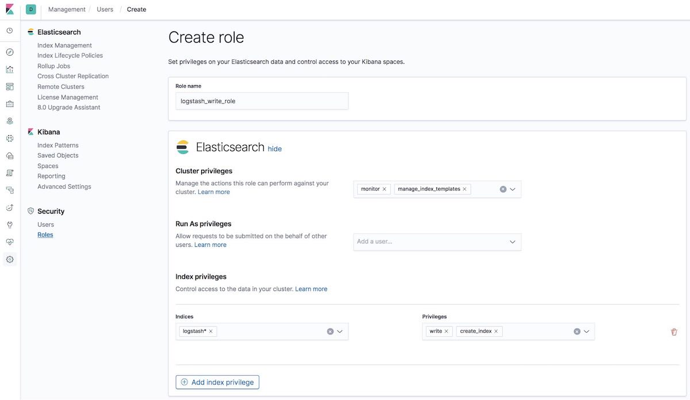

# Deploying ELK Stack with Docker and SSL

## Overview 

This guide details the process of deploying the Elasticsearch, Logstash, Kibana, and Metricbeat (ELK) stack on multiple servers with SSL and security enabled. We'll leverage Docker and Docker Compose for deployment to ensure cross-platform compatibility.

## Single Node Setup 

We'll begin with a single node configuration, deploying on 7 CentOS OS nodes.

### 1. Docker and Docker Compose Installation

Follow Docker's official installation guide for CentOS:

- [Docker Installation Guide for CentOS](https://docs.docker.com/engine/install/centos/)

### 2. Data Folder Preparation

```shell
sudo mkdir /home/data/
sudo chown 1000:1000 /home/data
```

### 3. Grant sudo Privileges to Your User

```shell
usermod -aG wheel <your_user>
```

### 4. Change the Server Hostname

```shell
sudo hostnamectl set-hostname <newhostname>
sudo vi /etc/hosts
```

### 5. Update Virtual Memory Settings and Reboot

Follow Elasticsearch's official guide on setting virtual memory:

- [Elastic.co - Setting Virtual Memory](https://www.elastic.co/guide/en/elasticsearch/reference/current/vm-max-map-count.html)

```shell
grep vm.max_map_count /etc/sysctl.conf
vm.max_map_count=262144
```

### 6. Transfer Configuration Files to the Server

Copy the files under the `single_node` directory to the target server.

### 7. Launch the First Server from Single Node Configuration

```shell
cd es_kibana
sudo docker-compose up 
## OR
sudo docker-compose up -d
sudo docker-compose logs -f elasticsearch
```

### 8. Verify the Single Node 

Access Elasticsearch at: `http://<your_server_ip>:9200` and Kibana at: `http://<your_server_ip>:5601` to ensure the server is running.

### 9. Generate Certificate Files Using Single Node Configuration

Update the `instance_product.yml` file as per your server structure.  Copy the instance file to server's data folder. Then, use the Elasticsearch docker instance to generate the certificate files. Copy and unzip the certs file from the single node server data folder. 
```shell
# Get to instance
sudo docker compose exec elasticsearch /bin/bash
# Generate CA certificates
bin/elasticsearch-certutil ca -pem --out /usr/share/elasticsearch/data/certs/ca.zip
unzip /usr/share/elasticsearch/data/certs/ca.zip -d /usr/share/elasticsearch/data/certs/

# Generate node certificates in pem format
bin/elasticsearch-certutil cert -pem --ca-cert /usr/share/elasticsearch/data/certs/ca/ca.crt --ca-key /usr/share/elasticsearch/data/certs/ca/ca.key --in /usr/share/elasticsearch/data/certs/instance_product.yml  --out /usr/share/elasticsearch/data/certs/certs_product.zip

# Generate node certificates in p12 format
bin/elasticsearch-certutil cert --ca-cert /usr/share/elasticsearch/data/certs/ca/ca.crt --ca-key /usr/share/elasticsearch/data/certs/ca/ca.key --in /usr/share/elasticsearch/data/certs/instance_product.yml  --out /usr/share/elasticsearch/data/certs/certs_product_p12.zip
```

Stop the single node docker instance with the following command:

```shell
# Press Ctrl + C to stop if you didn't add -d when startup docker compose instance
sudo docker compose down
```

## Multiple Servers Setup Steps

### Elasticsearch

#### 1. Start first ES cluster node

Copy the [es](./es) folder to the server. Update the [docker-compose file](./es/docker-compose.yml) and certs folder for the certificate files. You can use pem or p12 format. Remember to update and uncomment the `initial_master` and `discovery.seed_hosts`, `extra_hosts` later when multiple nodes are up.

#### 2. Data Folder Preparation

```shell
sudo mkdir /mnt/data/
sudo chown 1000:1000 /mnt/data
```

#### 3. Check the server hostname and virtual memory settings

```shell
sudo hostnamectl set-hostname <newhostname>
sudo cat /etc/hosts 
grep vm.max_map_count /etc/sysctl.conf
vm.max_map_count=262144
``` 

####  4. Start up the docker instance and generate passwords

```shell
cd es
# start the instance
sudo docker compose up -d
# check the logs
sudo docker compose logs -f elasticsearch 
# generate the password 
sudo docker compose exec elasticsearch /bin/bash bin/elasticsearch-setup-passwords auto -u "https://elasticsearch:9200" 
```

Note down the generated passwords.

#### 5. Verify the SSL and security enabled cluster

Use the `elastic` user to check the following addresses are running correctly:

- Specific node: `https://<your_server>:9200/`
- All nodes: `https://<your_server>:9200/_cat/nodes`

#### 6. Repeat the steps on all the other nodes except password generation

### Test Network and Speed Between Servers Using IPerf 

```shell
sudo yum install epel-release
sudo yum install iperf 
## On Server: 
sudo systemctl stop firewalld iperf -s -4 -p 45678
## On Client: iperf -c <host-ip> -p 45678 
```

### Kibana
First, copy the [kibana](./kibana) folder to your server. Then, update the [docker-compose file](./kibana/docker-compose.yml) and the certs folder with the appropriate certificate files. You can use the same certificate files that were generated for Elasticsearch. 

Remember to update the [.env](./es/kibana/.env) file`ELASTICSEARCH` (ES host)and `NODE_NAME`(kibana node name), `KIBANA_SYSTEM_PASSWORD`(password generated [previously](####  4. Start up the docker instance and generate passwords) ) 

To start the Kibana docker instance, navigate to the Kibana directory and use the `docker-compose up` command. If you want the instance to run in the background, use the `-d` flag. You can check the logs with the `docker-compose logs -f kibana` command.

```shell
cd kibana
sudo docker-compose up 
# OR for running in the background
sudo docker-compose up -d
# To check the logs
sudo docker-compose logs -f kibana
```

Verify that Kibana is running by navigating to `http://<your_server_ip>:5601` in your web browser.


### Logstash
#### Create a logstash writer user.
To create a Logstash writer user, follow the steps outlined in "Step 5. Prepare Logstash users on node1" in this [guide](https://www.elastic.co/blog/configuring-ssl-tls-and-https-to-secure-elasticsearch-kibana-beats-and-logstash#prepare-logstash). Ensure that the logstash_write user has the necessary permissions to write and create the index specified in the pipeline setting.


#### Update configuration 
Next, update the Logstash configuration. Copy the [logstash](./logstash) folder to your server and make the following updates to the certificates, configuration files, and `.env` file. The default template is configured to grab data from MySQL and store it in Elasticsearch.

It's important to note that internally, dates in Elasticsearch are converted to UTC (if the time zone is specified) and stored as a long number representing milliseconds since the epoch. However, for Logstash, you can set the timezone variable in the Docker Compose environment section and adjust the pipeline schedule according to the local time.

- [https://www.elastic.co/guide/en/elasticsearch/reference/current/date.html](https://www.elastic.co/guide/en/elasticsearch/reference/current/date.html)

#### Start the docker instance
To start the Logstash Docker instance, follow these steps:

1. Copy the [logstash](./logstash) folder to your server.
2. Update the necessary files, including the certificates, configuration files, and `.env` file.
3. Start the Docker instance.

```shell
cd logstash
sudo docker-compose up 
# OR for running in the background
sudo docker-compose up -d
```

By following these steps, you will successfully start the Logstash Docker instance.


### Metricbeat

Finally, let's set up Metricbeat. Use the [metricbeat](./metricbeat) folder and update the certs files, `.env` file, node list, monitor user password, etc. Then, start the Docker instance.

```shell
cd metricbeat
sudo docker-compose up 
# OR for running in the background
sudo docker-compose up -d
# To check the logs
sudo docker-compose logs -f metricbeat
```

This completes the setup of the ELK stack with Docker and SSL. Remember to always verify each service is running correctly after setup. You can check the status at https://<kibana_server>:5601/app/monitoring#/overview.
